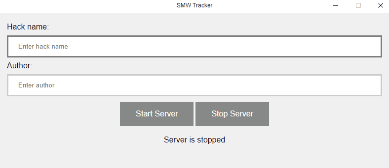

# SMW-Tracker

**SMW-Tracker** is an Electron app designed to enhance your Super Mario World streaming experience by tracking game stats such as deaths, exits cleared, and playtime, and displaying them live.

## Disclaimer
This app was originally written for my own purposes to utilise it myself and get a better understanding of nodejs and Electron.

I take no responsibilities for things breaking or not working correctly. For more information see the See the [Collaboration Guidelines](#collaboration-guidelines) for more details.

## About

**SMW-Tracker** hosts a local web server to monitor and display gameplay statistics for Super Mario World, ideal for live streaming purposes using OBS or other broadcasting software. This tool helps you engage with your audience by providing real-time updates on your gameplay progress.

**Features:**
- **Live Updates:** Track and display deaths, exits cleared, and session duration.
- **Persistent Data:** Keeps track of statistics across sessions.
- **Easy Integration:** Simple setup for streaming with OBS or any browser-supported streaming service.


## Usage
First you need to set up your SNES/Emulator to work with [QUsb2Snes](https://skarsnik.github.io/QUsb2snes/).

* Before you start your SNES/Emulator, make sure QUsb2Snes is running on your local machine.
* Start Super Mario World and confirm that QUsb2Snes is detecting it.
* Stay on the title screen (the timer only starts when a file is loaded)
* Start SMW Tracker.
* Enter the name and the author and press start server.

* Head to http://localhost:3000 on your webbrowser or use it as a browser source in OBS.
* Confirm that http://localhost:3000 shows the details you've entered.
* Load an existing, or start a new SMW file on your SNES/Emulator.
* The timer should start and the tracker will dynamically update everything.
* You can now minimise the app.
* When you want to stop, simply stop the server or close the app.
* On next startup, the GUI should show your last entered details
* It also saves your stats from previous sessions, make sure to enter the same name.
  * (Save data can be found at: %appdata%\smw-tracker\saveData.json)

## Collaboration guidelines
I am not currently accepting pull requests, as this is a hobby/passion project for my own entertainment.
For any issues or suggestions, [feel free to raise an issue](https://github.com/Ferlow/SMW-Tracker/issues), but I cannot promise if/when I will look into it.

## Copyright

[LICENCE: MIT](LICENCE)

### Dependencies

```json
  "dependencies": {
    "custom-electron-titlebar": "^4.2.8",
    "ejs": "^3.1.9",
    "express": "^4.19.2",
    "ws": "^8.16.0"
  },
  "devDependencies": {
    "electron": "^29.3.0",
    "electron-builder": "^24.13.3",
    "electron-packager": "^17.1.2"
  }
```

## Build Guide

To build SMW-Tracker on your local system, follow these steps:

1. Clone the repository:

```
git clone https://github.com/Ferlow/SMW-Tracker.git
```

2. Navigate to the project directory:

```
cd SMW-Tracker/
```

3. Install dependencies:

```
npm install
```

4. Build the application:

```
npm run dist
```

This will compile the application and prepare it for use on your system.
